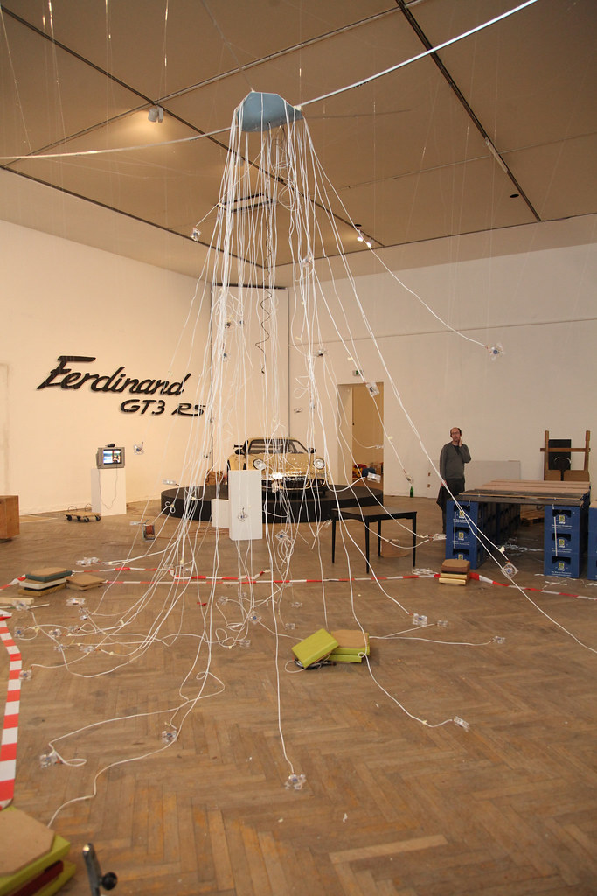
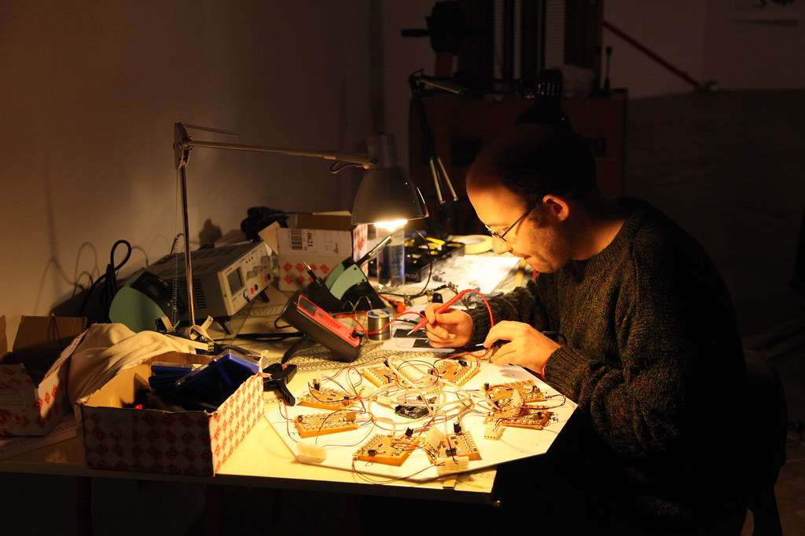

### Description
BitCoinCloud is an interactive room installation that explores the (virtual) value of artistic products and alternative economies. The modular artwork consists of a "BitCoin Mining Rig" (modified computers for calculating the virtual currency "BitCoins") and an LED cloud (visualization). BitcoinCloud responds to today's attention-centered era with the direct dependency between attention and the value of the artwork: the more visitors turn to the sculpture (camera tracking), the more virtual currency units (BitCoins) are calculated, which in turn increases the total value of the installation.

The installation was exhibited from November 16, 2011 to February 19, 2012 at Künstlerhaus Wien as part of the "Kunst und Kapital" (Art and Capital) exhibition, and from January 19, 2012 at MuseumsQuartier Wien, quartier21 in the Artistic Research Technology Lab.

### Beschreibung (DE)
BitCoinCloud ist eine interaktive Rauminstallation, die den (virtuellen) Wert von künstlerischen Produkten sowie alternative Ökonomien thematisiert. Das modulare Kunstwerk besteht aus einem "BitCoin Mining Rig" (modifizierte Computer zur Errechnung der virtuellen Währung "BitCoins") sowie einer LED-Cloud (Visualisierung). BitCoinCloud reagiert auf die aufmerksamkeitszentrierte heutige Zeit mit der direkten Abhängigkeit zwischen Beachtung und Wert des Kunstwerks: wenden sich mehr Besucher der Skulptur zu (Camera-Tracking), dann werden mehr virtuelle Währungseinheiten (BitCoins) errechnet, die wiederum den Gesamtwert der Installation erhöhen.

Die Installation wurde vom 16. November 2011 bis 19. Februar 2012 im Künstlerhaus Wien als Teil der Ausstellung "Kunst und Kapital" gezeigt und ab 19. Jänner 2012 im MuseumsQuartier Wien, quartier21 im Artistic Research Technology Lab.

### References
- http://www.k-haus.at/de/ausstellung/57/metamart.html
- Künstlerhaus Jahresbericht 2011 (Catalog): https://www.kuenstlerhaus.at/z/files/jahresberichte/jahresbericht_2011.pdf
  - verification note: catalog includes mention of Matthias Tarasiewicz in relation to BitcoinCloud/ArtMart context.
- http://bitcoincloud.at (archived)
- http://metamart.at/about-metamart/ (archived)
- http://artistictechnology.at/ (archived)
- Academic publication: Newman, A. (2015). "Experiments in art and value: burning Bitcoins to buy Ai Weiwei". ISEA 2015 submission. (Available in RIAT publications archive)

### Archive snapshots
- http://www.k-haus.at/de/ausstellung/57/metamart.html
  - https://web.archive.org/web/20160503140222/http://www.k-haus.at/de/ausstellung/57/metamart.html
- http://bitcoincloud.at
  - https://web.archive.org/web/20120930031145/http://bitcoincloud.at/
  - https://web.archive.org/web/20121224160643/http://bitcoincloud.at/
- Flickr photo documentation: https://www.flickr.com/photos/artisticbokeh/8457511011/in/album-72157631703295702

### Local Documentation
- Installation setup photo: 
- Metamart switchboard: 

## Resources
* http://www.k-haus.at/de/ausstellung/57/metamart.html
