# [Research Cultures] Artistic Bokeh, Société Réaliste & Georgios Papadopoulos: Too much money…

## Event Details

- **Date**: February 27, 2014
- **Time**: 19:00
- **Location**: Artistic Bokeh Showroom, Electric Avenue, MuseumsQuartier Vienna
- **Organizer**: Artistic Bokeh
- **Type**: Exhibition Opening / Research Presentation
- **Context**: Opening event for the "Too much money" exhibition

## Event Timeline

### 19:00 - 19:30
- Exhibition preview and welcome

### 19:30
- **Introduction by Matthias Tarasiewicz**
- **Presentation by Georgios Papadopoulos & Carsten Lisecki**
- **Film Screening**: *Art Accounts Deutsche Bank (2013)* by Carsten Lisecki
- **Discussion**

### Until 22:00
- Money Sounds Playlist
- Money and Value Visuals

## Exhibition Context

The opening event launched the exhibition **"Too much money..."** which ran from February 27 to May 31, 2014. The exhibition addressed the ambivalent relationship between art and the market, pointing to the problematics of commodification, alienation, and co-optation of creativity.

### Exhibition Components
1. **Artistic Bokeh**: "4107$" - Performance and artistic research, 2014
2. **Société Réaliste**: "A Proposal for a New Alphabetical Order Based on the Esperanto Writing System and Pegged on the Euro Rates" - Digital print, 2014

## Themes Explored

### Art and Market Relations
The intervention of money in social life creates a new layer of meaning by ascribing prices to objects and relations. The reorganization of society as a market imposes principles of efficiency, rationality, and individualism on social relations, alienating fundamental social bonds.

### Artistic Autonomy
Art remains a privileged domain for reflecting on the conditions of social existence through new forms of representation and subjectification. However, the artist's ability to intervene is compromised by reliance on the market for both material support and recognition.

### Economic Contradictions
The recent financial crisis and consequent cuts in the cultural sector disclose the contradictions of the socioeconomic environment where artists must survive. Adverse economic conditions create pressure toward conservatism and conformism with neoliberal ideology.

## Participants

### Georgios Papadopoulos
Greek artist and researcher combining economics and philosophical analysis with exploratory artistic practice. His research gravitates around money and its socioeconomic functions.

### Société Réaliste
Parisian cooperative created by Ferenc Gróf and Jean-Baptiste Naudy in June 2004, working with political design, experimental economy, territorial ergonomy, and social engineering consulting.

### Carsten Lisecki
Artist and filmmaker presenting *Art Accounts Deutsche Bank (2013)*, exploring the relationship between art institutions and financial systems.

### Matthias Tarasiewicz
RIAT founder and Artistic Bokeh coordinator, providing introduction and context.

## References and Links

### Primary Sources
- **Artistic Bokeh Post**: [Artistic Bokeh, Société Réaliste & Georgios Papadopoulos: Too much money... Opening: 27.2.2014](https://web.archive.org/web/20160304034444/http://artisticbokeh.com/)
- **eSeL listing**: https://www.esel.at/de/event/artistic-bokeh-societe-realiste-too-much-money--02vvBxhCsIkG1aawt7kgtQ
- **MQW artist context**: https://www.mqw.at/en/institutions/q21/artists-in-residence/2014/georgios-papadopoulos

### Related Exhibition
- **"Too much money" exhibition**: February 27 - May 31, 2014
- **Flickr documentation**: [72157641626930984](https://www.flickr.com/photos/artisticbokeh/sets/72157641626930984/))

### Archive Snapshots
- https://web.archive.org/web/20141016221021/http://artisticbokeh.com//post/artistic-bokeh-societe-realiste-georgios-papadopoulos-too-much-money-opening-27-2-2014

## Significance
This opening event launched a significant exhibition exploring the complex relationship between art, money, and market systems. It brought together artists, researchers, and theorists to examine how economic systems shape artistic production and how art can critically engage with economic realities.

## Facebook Documentation

This event has been enhanced with **27 images** from the Facebook album documenting the exhibition opening (imported March 5, 2026 from riat.ac.at Facebook export).

### Facebook Sources
- **Facebook Event**: https://www.facebook.com/events/mq-museumsquartier-wien/artistic-bokeh-société-réaliste-georgios-papadopoulos-too-much-money-opening-272/619848824747223/
  - Archive.org: https://web.archive.org/web/20200101000000/http://facebook.com
- **Facebook Album**: https://m.facebook.com/media/set/?vanity=riat.ac.at&set=a.867841076611863
  - Contains 27 exhibition photos documenting the opening event

### Facebook Images

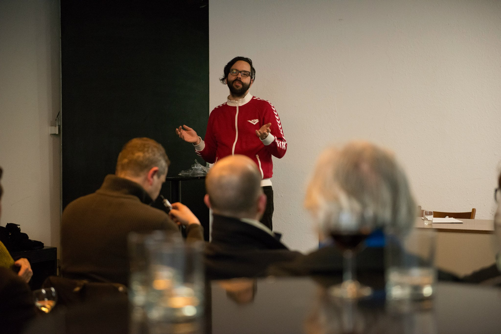

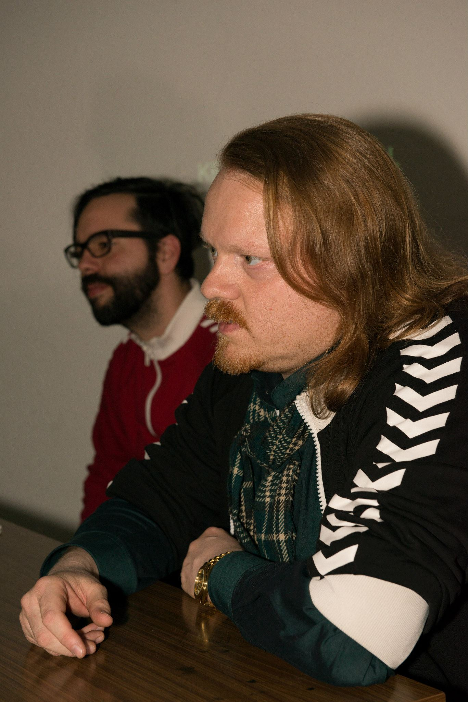
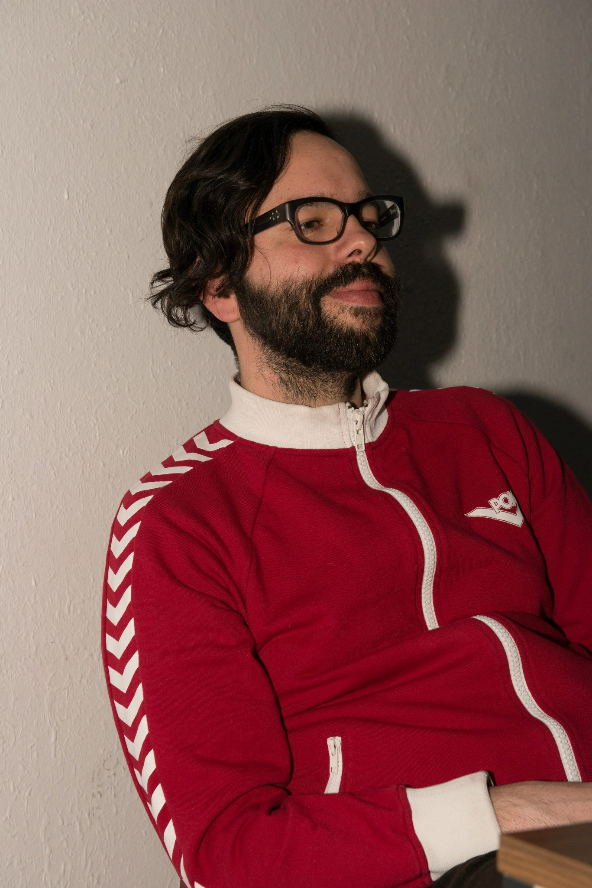
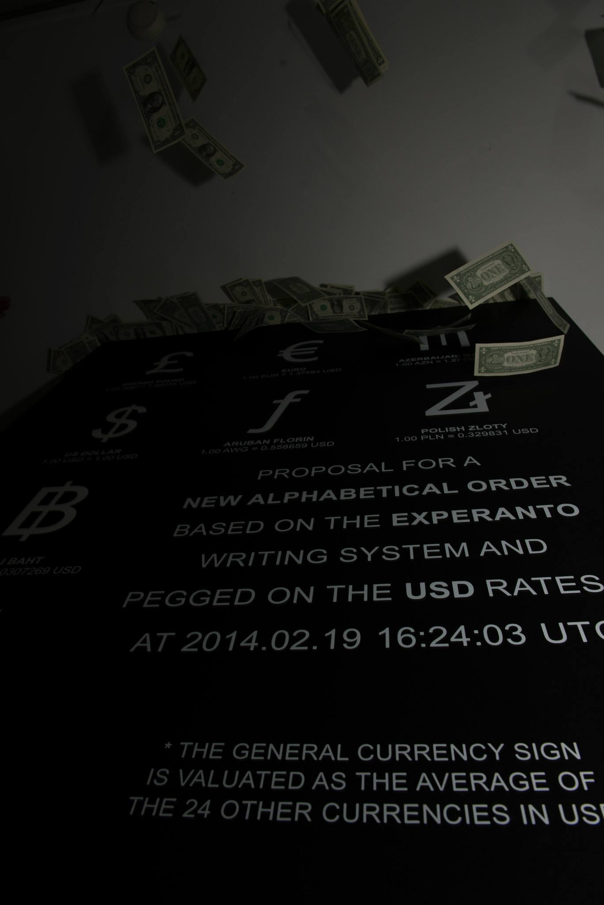

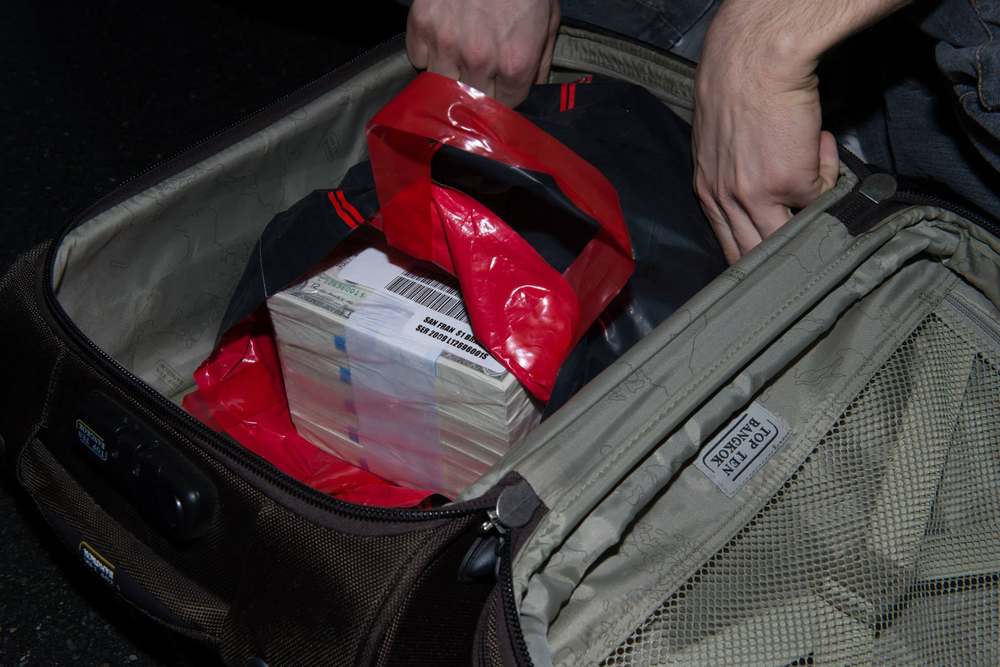
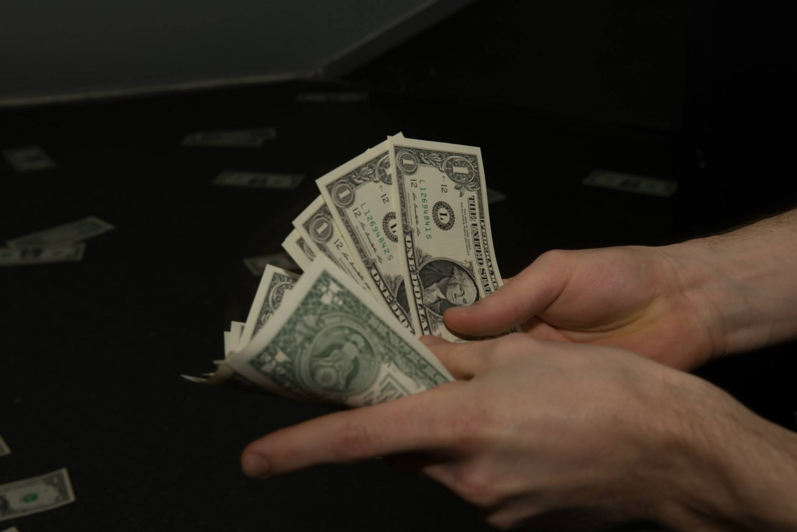

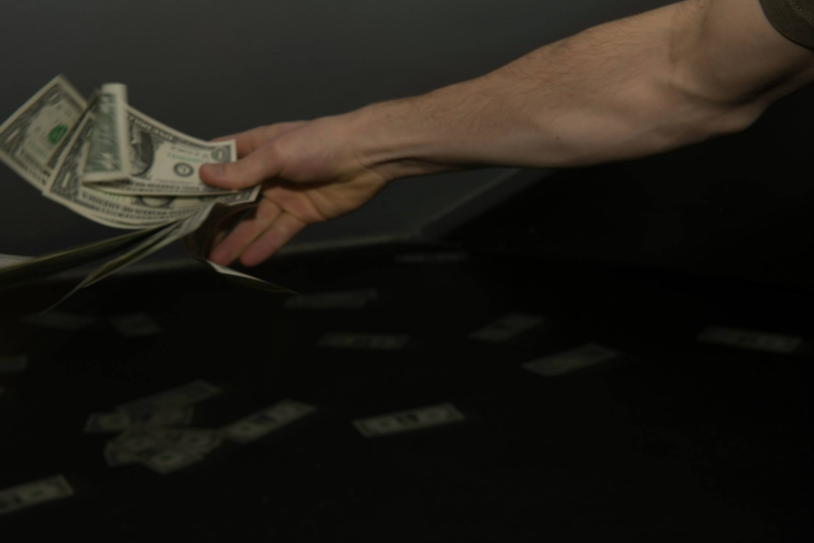

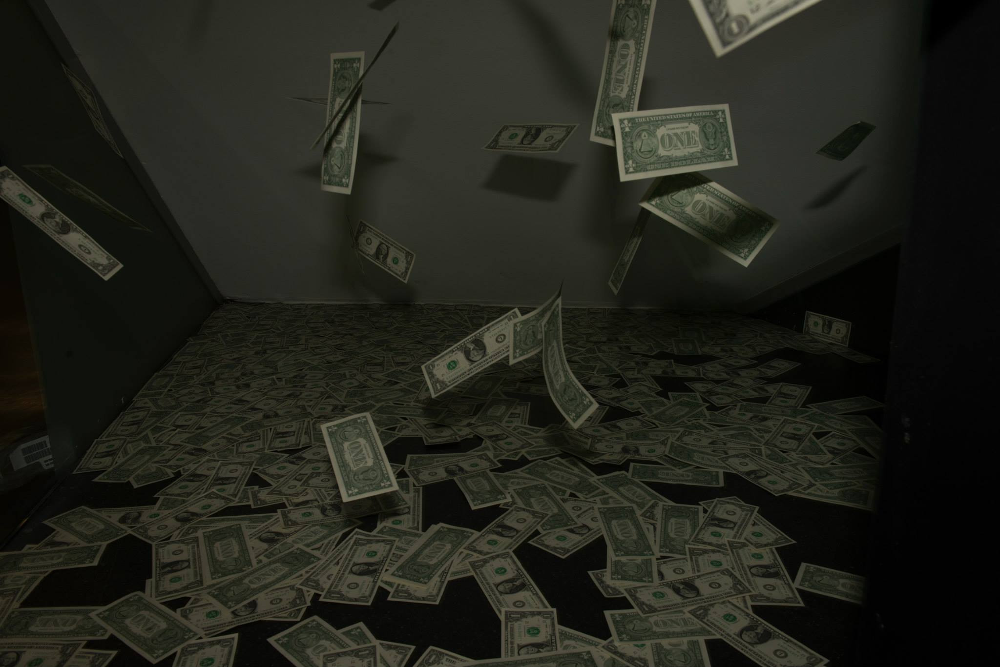

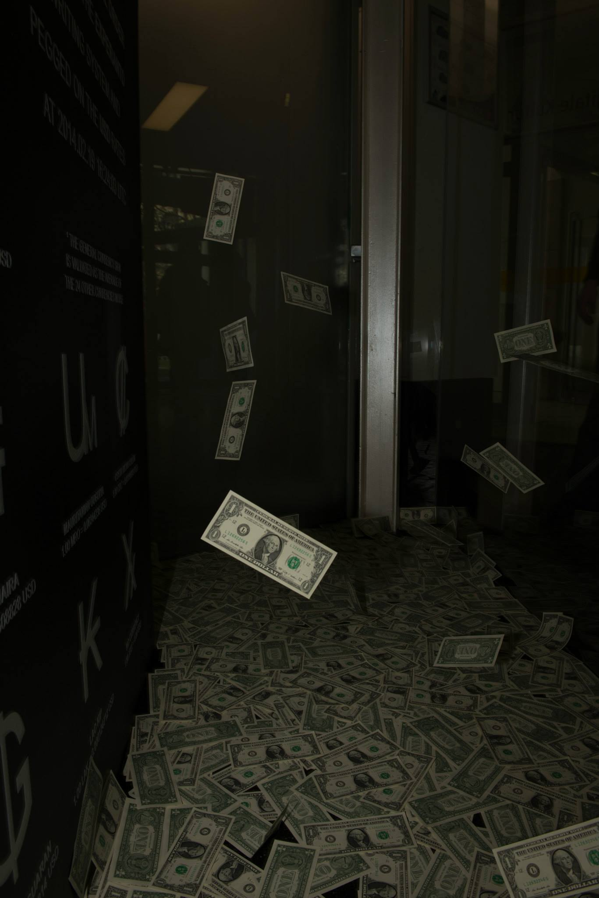

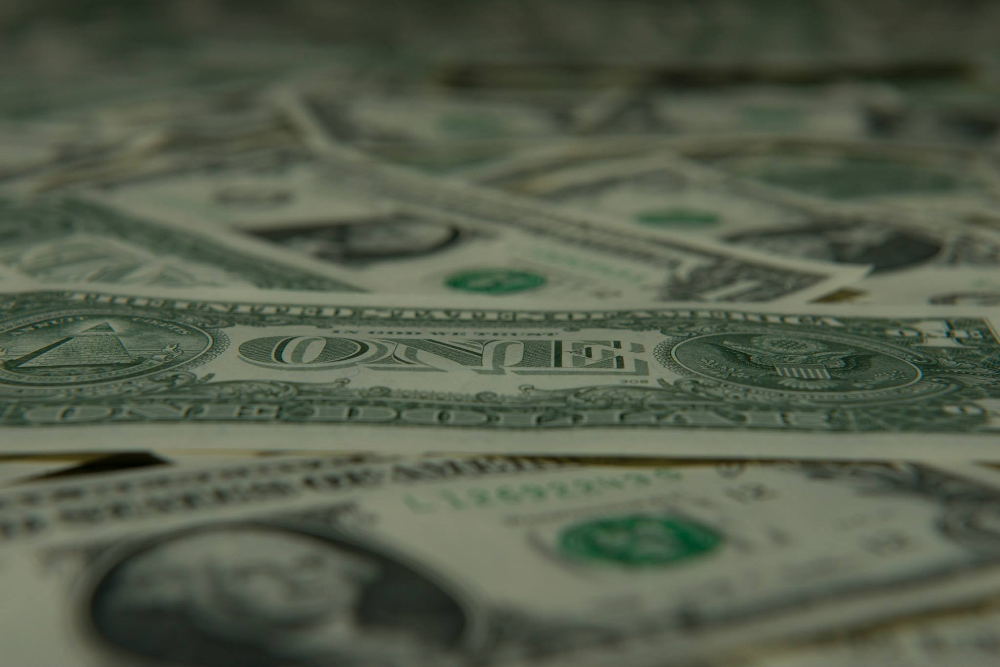

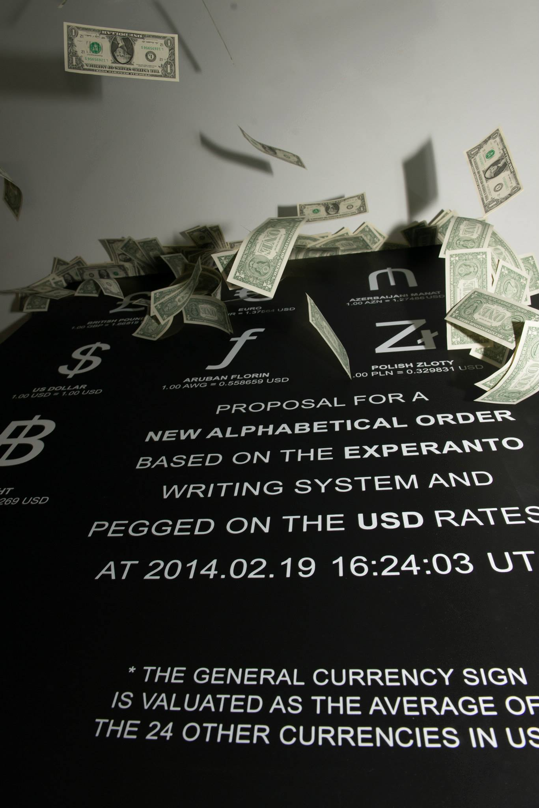

## Complete Source Documentation

### Exhibition Pages
- **Die Angewandte**: https://www.dieangewandte.at/ausstellungen/artistic_bokeh_societe_realiste__georgios_papadopoulos
- **University of Applied Arts**: https://artscience.uni-ak.ac.at/activities/representing_sustainability__economic_discourse_and_artistic_practise

### Interviews & Publications
- **MQW Journal Interview**: https://www.mqw.at/mq-journal/2014/interview-mit-georgios-papadopoulus

### Venue & Location
- **eSeL.at Event**: https://www.esel.at/de/event/artistic-bokeh-societe-realiste-too-much-money--02vvBxhCsIkG1aawt7kgtQ
- **eSeL.at Location**: https://www.esel.at/de/location/artistic-bokeh--02w3FIWoGuDaXlxIqHYCkY

### Visual Documentation
- **Flickr Photo**: https://www.flickr.com/photos/artisticbokeh/12816705944/
- **Flickr Set**: https://www.flickr.com/photos/artisticbokeh/sets/72157641626930984/

### Social Media
- **Facebook Event**: https://www.facebook.com/events/mq-museumsquartier-wien/artistic-bokeh-société-réaliste-georgios-papadopoulos-too-much-money-opening-272/619848824747223/
- **Facebook Album**: https://m.facebook.com/media/set/?vanity=riat.ac.at&set=a.867841076611863

### Archive Snapshots
- https://web.archive.org/web/20260227062603/https://www.esel.at/de/event/artistic-bokeh-societe-realiste-too-much-money--02vvBxhCsIkG1aawt7kgtQ
- https://web.archive.org/web/20191120062202/https://www.mqw.at/en/institutions/q21/artists-in-residence/2014/georgios-papadopoulos
- https://web.archive.org/web/20140913040141/http://artisticbokeh.com//post/artistic-bokeh-societe-realiste-georgios-papadopoulos-too-much-money-opening-27-2-2014
- https://web.archive.org/web/20160304034444/http://artisticbokeh.com/
- https://web.archive.org/web/20141016221021/http://artisticbokeh.com//post/artistic-bokeh-societe-realiste-georgios-papadopoulos-too-much-money-opening-27-2-2014

## Local Archive Status
All sources have been registered in the `sources_registry.db` database. Facebook images (27 photos) are preserved locally in the `images/` directory.
