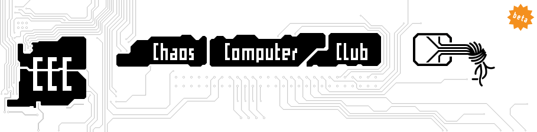

The Critical Decentralisation Cluster at the 35th Chaos Communication Congress (35C3) was an area and grouping of similar minded projects, which offered workshops and hosted a space to critically discuss the future of decentralization.

## Event Description

Clusters (in the terms of C3) are groupings of assemblies and provide the necessary infrastructure, space and context for specific experiences. The Critical Decentralisation Cluster provided an area for outreach and exchange in the categories Privacy & Anonymity, Coded Cultures and Open Hardware.

### Location
The cluster was located at **K4-L5, Exhibition Hall 2, Level 0** ([35C3 C3Nav](https://35c3.c3nav.de/l/cdc/@0,479.41,406.58,4.35)).

### Organization
The cluster was organised by **RIAT and the Monero Community** and made possible through voluntary work and support from individuals.

## Cluster Features

- **Recording stage** with slots for presentations
- **Dedicated workshop areas** for assemblies and similar minded groups/projects
- **Coffee area** from Paralelni Polis
- **Hacking/working/learning space**

## Talks and Workshops
Proposals for talks and workshops were accepted through the [frab system](https://frab.riat.at/en/35c3/cfp). The full CDC program is available in the [frab Schedule](https://frab.riat.at/en/35c3/public/timeline).

## Communication Channels

- **DECT phone number**: 7428
- **Public Telegram channel**: https://t.me/joinchat/I90xDA5u1mG4jGdveCPdjg
- **IRC**: [#monero-ccc on freenode](http://webchat.freenode.net/?channels=monero-ccc)

## About CCC / C3

The [Chaos Computer Club](https://www.ccc.de/en/club) (CCC) is the largest (and oldest) hacker association in Europe and was founded in 1981. Originating from Germany, it has spread over Europe and organizes numerous events, including the annual [Chaos Communication Congress](https://en.wikipedia.org/wiki/Chaos_Communication_Congress).

The congress takes place between Christmas and New Year's Eve, since 1984. It is considered one of the largest (over 15,000 attendees) events of this kind, alongside [DEF CON](https://defcon.org) in Las Vegas.

## Resources
- https://decentral.community/35C3/
- https://events.ccc.de/congress/2018/wiki/index.php/Assembly:Critical_Decentralisation_Cluster
- https://frab.riat.at/en/35c3/public/timeline
- https://www.namecoin.org/2019/05/08/35c3-summary.html
- https://www.youtube.com/watch?v=Xu_QH6oi7oA&list=PLsSYUeVwrHBn07zTBg7fGHRW5Kn_Z3FJL

## Archive snapshots
- https://decentral.community/35C3/
  - https://web.archive.org/web/20260226163934/https://decentral.community/35C3/
- https://events.ccc.de/congress/2018/wiki/index.php/Assembly:Critical_Decentralisation_Cluster
  - https://web.archive.org/web/20240201000000/https://events.ccc.de/congress/2018/wiki/index.php/Assembly:Critical_Decentralisation_Cluster
- https://external-content.duckduckgo.com/iu/?u=https%3A%2F%2Fwww.basecybersecurity.com%2Fwp-content%2Fuploads%2F2020%2F01%2F36C3-Chaos-Computer-Club-December-2019-Leipzig-Germany.png&f=1&nofb=1
  - https://web.archive.org/web/20260225053709/https://external-content.duckduckgo.com/iu/?u=https%3A%2F%2Fwww.basecybersecurity.com%2Fwp-content%2Fuploads%2F2020%2F01%2F36C3-Chaos-Computer-Club-December-2019-Leipzig-Germany.png&f=1&nofb=1
- https://www.youtube.com/watch?v=Xu_QH6oi7oA&list=PLsSYUeVwrHBn07zTBg7fGHRW5Kn_Z3FJL
  - https://web.archive.org/web/20260225053709/https://www.youtube.com/watch?v=Xu_QH6oi7oA&list=PLsSYUeVwrHBn07zTBg7fGHRW5Kn_Z3FJL

