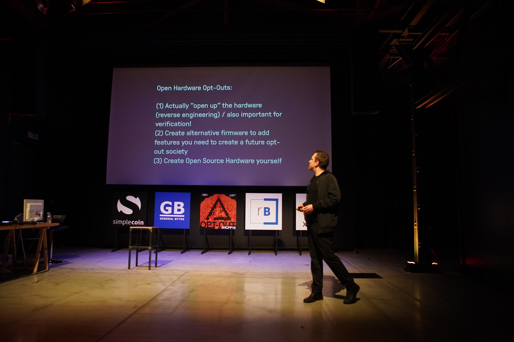

# Opt‑Out: The past, present and future of Open and Libre Hardware

*Photo: Matthias Tarasiewicz (HCPP Opt‑Out talk, Prague, 2019‑10‑04).* 

## Summary
Talk listed within **Open Hardware Dialogues** at HCPP (Opt‑Out) as part of Open Hardware Month 2019.

## Sources
- https://riat.at/open-hardware-dialogues/
- https://ohm.oshwa.org/event/talk-the-past-present-and-future-of-opt-out-with-open-and-libre-hardware/
- https://opt-out.hcpp.cz/#speakers

## Archive snapshots
- https://opt-out.hcpp.cz/#speakers
  - http://web.archive.org/web/20241013174515/https://opt-out.hcpp.cz/#speakers
