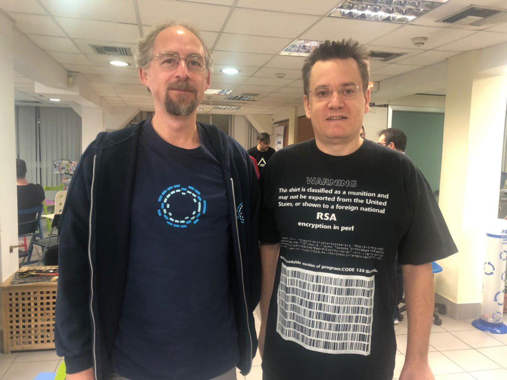

*Photo: Matthias Tarasiewicz (Athens, 2019-11-02).*

Talk series / meetup appearance in Athens featuring:

- Adam Back (Blockstream CEO) — topic listed as **Simplicity** (smart-contract language for Bitcoin/UTXO chains)
- David Chaum — topic listed as **Praxxis** (quantum-resistant digital currency)
- Matthias Tarasiewicz — RIAT / Institute for Future Cryptoeconomics

Language: English. Entry listed as free/open event.

## Resources
- Meetup listing: https://www.meetup.com/BlockchainGreece-0/events/265974634/
- Bitcointalk thread (Greek community context): https://bitcointalk.org/index.php?topic=5196185.0

## Archive snapshots
- Meetup (Wayback): https://web.archive.org/web/20191115001201/https://www.meetup.com/BlockchainGreece-0/events/265974634/
- Bitcointalk (Wayback): https://web.archive.org/web/20200606202952/https://bitcointalk.org/index.php?topic=5196185.0
- https://www.meetup.com/BlockchainGreece-0/events/265974634/
- https://bitcointalk.org/index.php?topic=5196185.0
