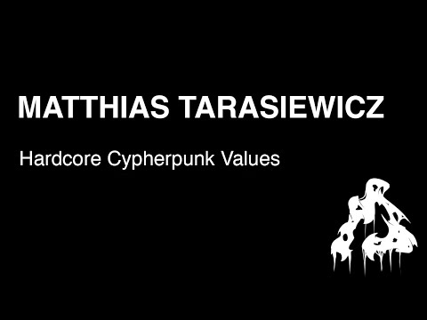

| Field | Value |
| :--- | :--- |
| Date | 2024-10-05 |
| Event | HCPP24 (Hackers Congress Paralelní Polis) |
| Location | Paralelní Polis, Prague |
| Title | Hardcore Cypherpunk Values |
| Speaker | Matthias Tarasiewicz |
| Primary source | https://www.youtube.com/watch?v=PhO7TflQjpg |

### Description
Matthias Tarasiewicz discusses "Hardcore Cypherpunk Values" at the Hackers Congress Paralelní Polis 2024 (HCPP24). The talk explores the fundamental principles of the cypherpunk movement, their evolution, and their necessity in the current digital landscape.

### Beschreibung (DE)
Matthias Tarasiewicz spricht auf dem Hackers Congress Paralelní Polis 2024 (HCPP24) über „Hardcore Cypherpunk Values“. Der Vortrag untersucht die grundlegenden Prinzipien der Cypherpunk-Bewegung, ihre Entwicklung und ihre Notwendigkeit in der heutigen digitalen Landschaft.

### References
- https://www.youtube.com/watch?v=PhO7TflQjpg
- https://hcpp.cz/
