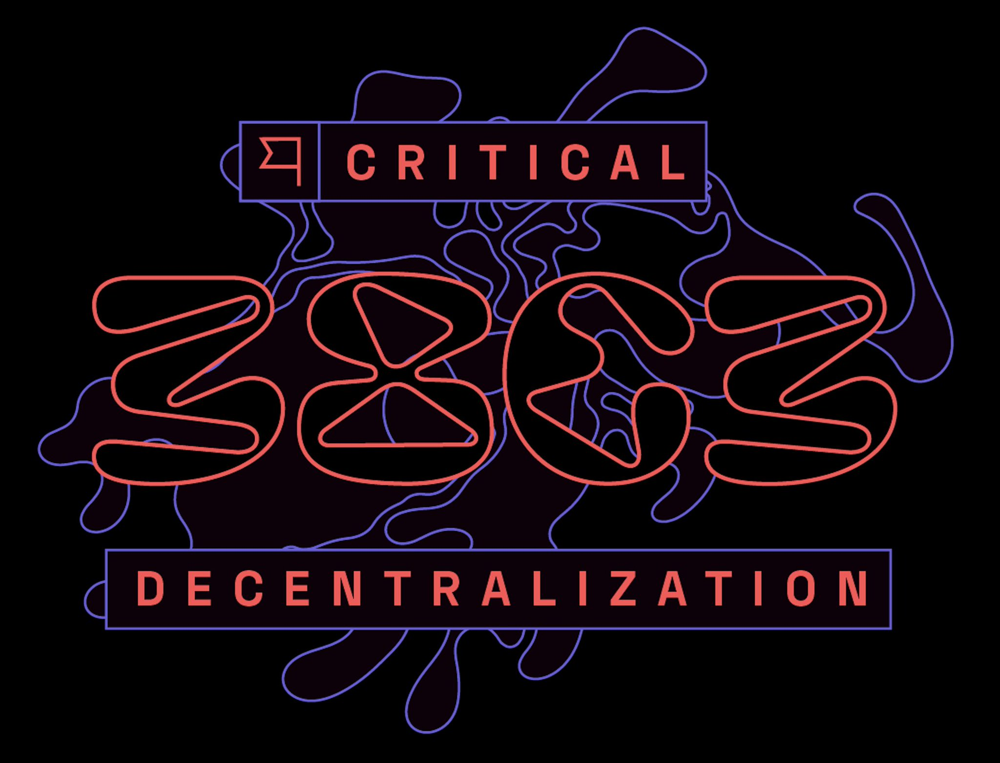
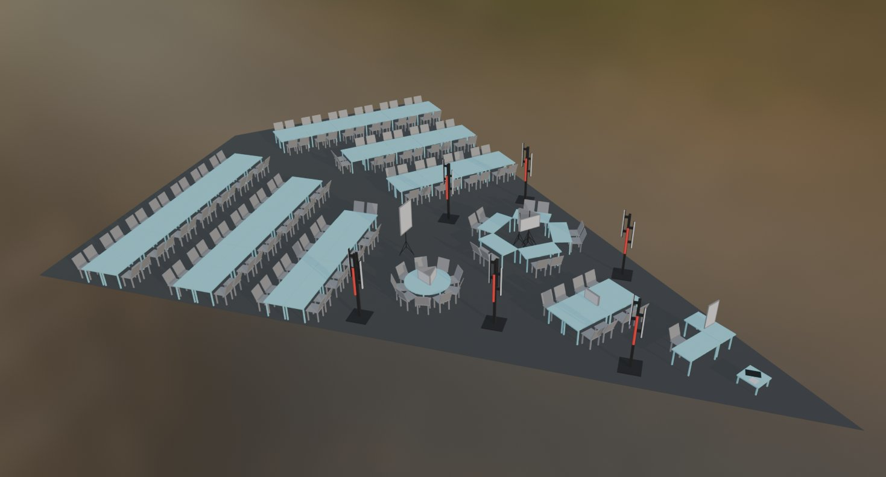

# 38C3: Critical Decentralisation Cluster

## Summary
At 38C3, the **Critical Decentralisation Cluster (CDC)** hosted talks and workshops on decentralisation, privacy, and open hardware. The cluster also contributed to the Community Stages program.

## Participating assemblies (full list)
- RIAT
- MoneroKon / Monero Community
- Replicant
- Namecoin
- GNU Boot
- Social Dist0rtion Protocol
- FOSSASIA
- Swiss Cryptoeconomics
- Department of Decentralisation
- Ethereum Foundation
- Reticulum
- Radicle
- Crypto Commons
- Off‑Grid Messaging
- Sibermerdeka
- HSBXL (Hackerspace Brussels / Squirrel)

## Location & comms
- Hall H, I2‑K3 (C3Nav): https://38c3.c3nav.de/l/cdc/@0,162.43,118.74,3.75
- Matrix: #cdc:dod.ngo
- Email: c3 at RIAT’s domain

## Tweet references
- **2024-12-03** — @parasew — “Excited for decentral.community (CDC) this year at #38C3… Current list of assemblies…”
  - URL: https://x.com/parasew/status/1863933839392780412
  - Media: images/1863933839392780412.jpg
- **2024-12-03** — @parasew — “Here is our cluster layout (on paper)… RIAT team will be in Hamburg from early Dec.”
  - URL: https://x.com/parasew/status/1863934408643748037
  - Media: images/1863934408643748037.jpg

## Sources
- CDC hub: https://decentral.community/38C3/
- CDC assembly listing: https://events.ccc.de/congress/2024/hub/en/assembly/cdc/
- CDC schedule (pretalx): https://pretalx.riat.at/38c3/schedule
- Community stages CFP: https://content.events.ccc.de/cfp/38c3-community-stages/index.en.html
- Namecoin 38C3 summary: https://www.namecoin.org/2025/03/30/38c3-summary.html

## Archive snapshots
- https://decentral.community/38C3/
  - https://web.archive.org/web/20260227064000/https://decentral.community/38C3/
- https://events.ccc.de/congress/2024/hub/en/assembly/cdc/
  - https://web.archive.org/web/20260227064000/https://events.ccc.de/congress/2024/hub/en/assembly/cdc/
