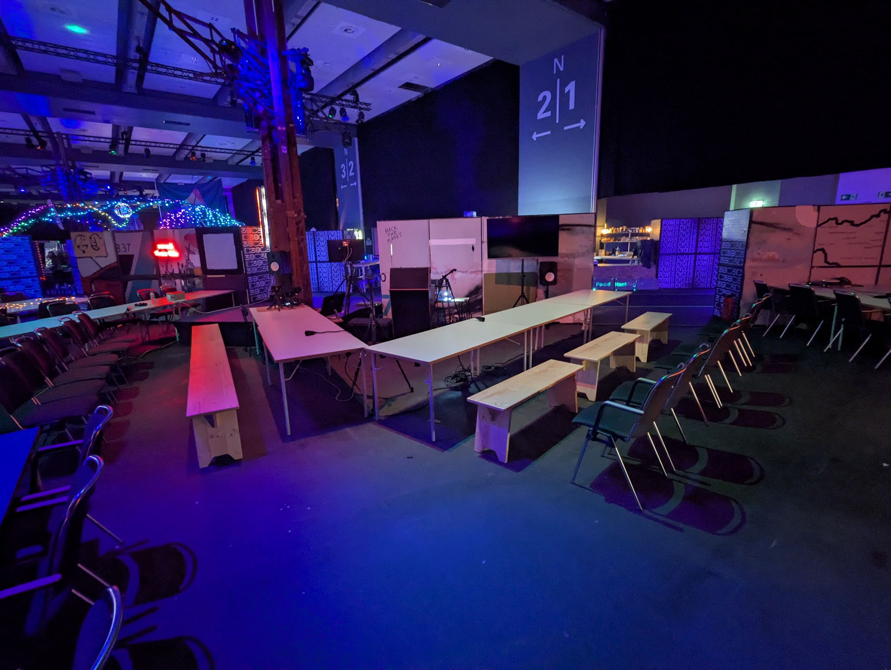

# 39C3: Critical Decentralisation Cluster

## Summary
The Critical Decentralisation Cluster (CDC) returned to 39C3, bringing together assemblies and projects working on decentralised infrastructure, privacy, and open hardware. RIAT co‑organized the cluster with community partners.

## Participating assemblies (full list)
- RIAT
- Monero Community
- Namecoin
- Swiss Cryptoeconomics
- I2P
- Cyberraum
- Radicle
- Social Dist0rtion Protocol
- GNU Boot
- Department of Decentralisation
- Firo
- Iroh
- FOSSASIA
- Off‑Grid Messaging
- Sibermerdeka
- Replicant
- Auditable silicon group TROPIC01
- Reticulum
- Infinite Build
- Crypto Commons
- BORDEL
- Gosling
- Cat Pictures Data Distribution Hub
- Nitrokey
- XMPP

## Sessions & layout
- Two workshop areas with public schedule (pretalx)
- CDC Triangle: mini‑stage + recording equipment
- CDC Circle: 3 screens, no recording

## Location & comms
- Hall H (C3Nav): https://39c3.c3nav.de/l/cdc/@0,189.91,122.12,4.34
- Matrix: #cdc:dod.ngo (bridged to hackint IRC)
- DECT: 7549
- Email: c3 at RIAT’s domain

## Sources
- CDC hub: https://decentral.community/39C3/
- CDC schedule (pretalx): https://pretalx.riat.at/39c3/schedule
- Official assembly listing: https://events.ccc.de/congress/2025/hub/en/assembly/detail/cdc
- CDC badge repo (RIAT LABS): https://github.com/riatlabs/cdc-badge
- C3Nav map: https://39c3.c3nav.de/l/cdc/@0,189.91,122.12,4.34

## Archive snapshots
- https://decentral.community/39C3/
  - https://web.archive.org/web/20260224204604/https://decentral.community/39C3/
